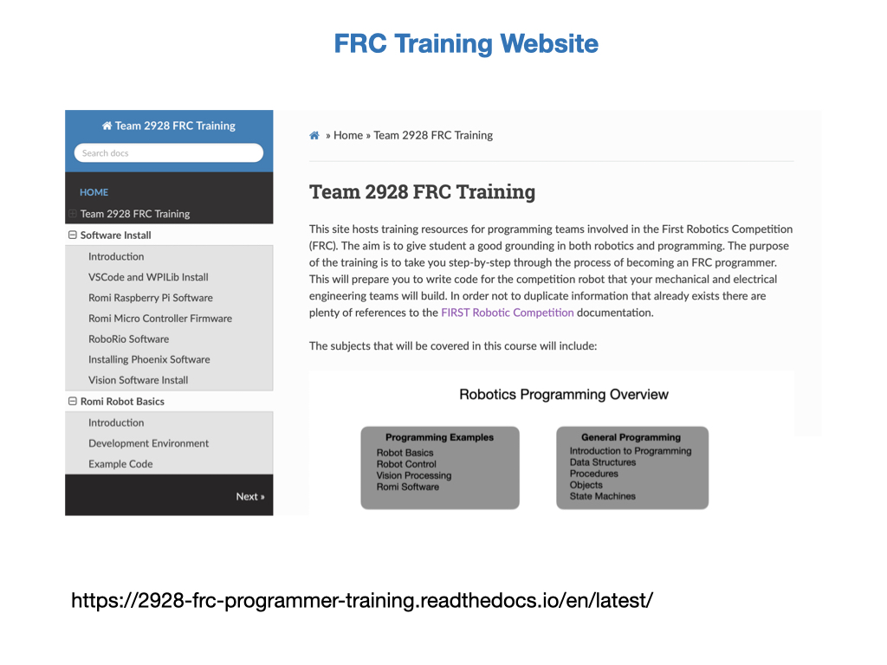

# FRC Programming Outline
*Programming experience of students; none, Webpage development, C++ Arduino, Java.*

*FIRST For Inspiration and Recognition of Science and Technology*

This course is about programming a robot that will compete in the FIRST Robotics Competition.  The mechanical and electrical teams will design and build the physical robot and it's our job as a member of the programming team to get it to do something.  Without us, the robot will be sitting in the middle of the game field doing nothing.

The FIRST Robotics Competition (FRC) is setup as a large sporting event. So there are cheering crowds, match commentators, and large event screens that display the game scores and team rankings. The event is also filmed and streamed live out onto the Internet.  Teams compete in the specially constructed arena that is about the size of a basketball court, with the goal of scoring as many points as possible while at the same time preventing the other team from scoring.  The key difference is that instead of having human players on the game field you have robots.  Each team gets to bring one custom built robot to the competition together with a driver and pit crew. It's similar to Formula One racing where you have a driver, and a pit crew that maintains and fixes the robot between matches. It's not a gentle sport, robots are crashing into one another all the time both intentionally and unintentionally.  The robot is designed specifically to navigate the obstacles on the field manipulate the game pieces. The obstacles, game pieces and rules of the game change every year, so teams need to design and build a new robot each season.

The FIRST organization is world wide and its purpose is to inspire young people to enter the field of science and technology.  Instead of competing with a ball you're competing with math, science, and technology.  There are a lot of kids that aspire to be a professional sports players but only a very few can make it.  But to quote Dean Kaman, the founder of FIRST Robotics, *"FIRST Robotics is like a sport where everyone can turn pro"*.  

## Robots from a Programming Perspective
A robot is a machine that senses and interacts with its environment.  Most robots will accept commands that tell it what tasks are to be completed. From a programming perspective you can think of a robot as a data driven machine.  Data is constantly being fed into it from onboard sensors that are detecting the world around it and from command input devices such as game controllers.  The internal brain of the robot, which is usually some kind of *Single Board Computer (SBC)*, will interpret the data and make a decision as to what to do next.  Often, that decision is to carry out a motion that interacts with its surroundings.  That may be moving forward several meters or perhaps picking up an object that is in front of it.  As it moves through the environment it's also getting data from internal sensors that tell it where it is what direction it's facing.

## What do I Need to Learn?

So what do you need to learn in order to effectively program the robot for competition?  In order to write code for a project you need to have a good understanding of what you are programming.  To program a robot you need to have an understanding of multiple engineering disciplines.  These include; Control Systems, Kinematics & Dynamics, Computer Vision, Machine Learning, and of course Programming.  Engineers can spend an entire career in just one of these subjects but don't worry, you don't need to know each subject in depth.  Over the next few seasons you'll get to understand a little about each subject.  Enough to win competitions.

## How do I Learn all this?
When you're learning a new subject, especially one that has a lot of parts to it, you need to have a plan.  Our team has put together a set of lessons that will take you step-by-step through what you need to know to program the robot.  We're constantly adding to the lessons so if you're here for multiple seasons you'll learn more and more about robotics.  You'll go through the learning path multiple times, each time getting a better understanding of how things work.

## The Romi Robot

This is where we're going practice most of our programming skills.  Romi is a small but very capable robot.  It allows us to experiment with the various robotic techniques before deploying them on the competition robot.  Having the Romi crash into a wall is a lot less distructive than firing a 120 pound robot at it.

As mentioned earlier there are three programming languages that we will learn, Java, Python, and C++.  We can run all three of these languages simultaneously on this little robot, each one processing its own task.

## Code Editing and Libraries
In order to write your program you're going to need a code editor.  A code editor is similar to a word processor except it is optimized to format program code instead of written text. It'll check the syntax of your code as you type it to make sure that it will compile properly. Each project is made up of multiple files that are also managed by the editor.  Once you're ready to try the program  out the compilation can be done in the editor before deploying it to the target computer.  The code editor used in FRC is *VSCode*.

When you install the FRC version of VSCode it will also install the *WPILib* libraries.  These libraries will make it much easier for you to write code and get the robot up and running quickly.  When you write a program you usually don't start from scratch.  A lot of the work has already been done for you.  You just need to put the library components together in a smart and efficient manner.  A lot of competitions will come down to who has the most innovative software.

## Github
When we write the code for the competition robot there are going to be multiple people working on the project.  In general, we would try to arrange it so as each person worked on a different part of the code, so you wouldn't all be updating the same file.  However, there are times when multiple people are going to have to update the same file, perhaps stepping on the each others work. At some point all of these changes are going to need to be merged together into a single project. Another thing we may want to do is keep multiple versions of our project so as we can load it onto different robots that might not have the same configuration.  So how do we manage all of this chaos?  

GitHub is a code hosting platform for version control and collaboration. Since everything is up on the Cloud, it lets you and others work together on projects from anywhere. Each team member can have a complete copy of the entire project code on their own computer. Therefore, all of the people have access to all of the code all of the time. It tells you when a change was made, what the change was, and who made it.  GitHub is the code and documentation repository to the world.  It has over 83 million developers who contribute to the open source community. 

## Documentation
One of the most important tools for any programmer is the documentation.  This lets us know how to structure the program and use the libraries.  Most documentation will show you a starter project that will point you in the right direction and verify the the software is installed correctly. When you first start out you will use this site a lot.  Even when you're an experienced FRC programmer you will reference this site constantly.  The main documentation Website for FRC is at [https://docs.wpilib.org](https://docs.wpilib.org).

The FRC documetation site has a lot of information that may not always be easy to find.  Our team has an additional Website called the [2928 Team Training Website](https://2928-frc-programmer-training.readthedocs.io/en/latest/) that takes you step-by-step through programming an FRC robot and has links to the FRC documentation site at relevant points. 

