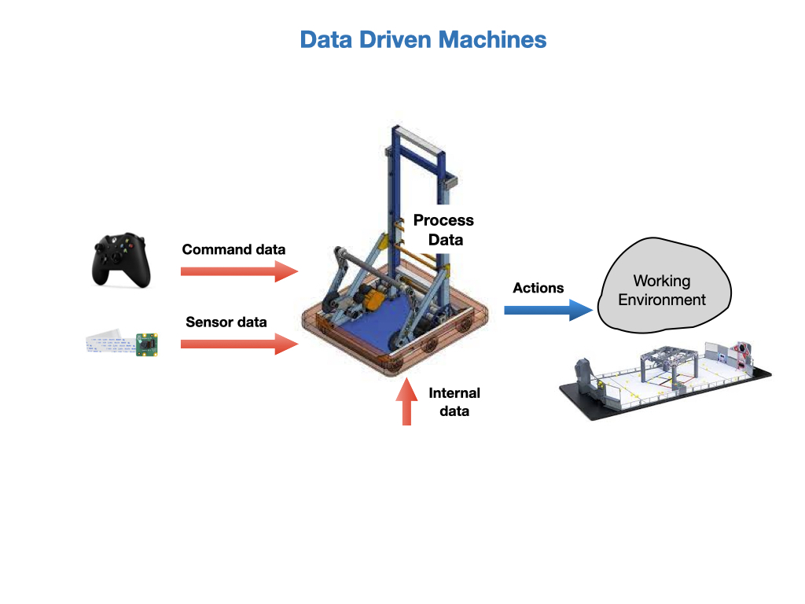
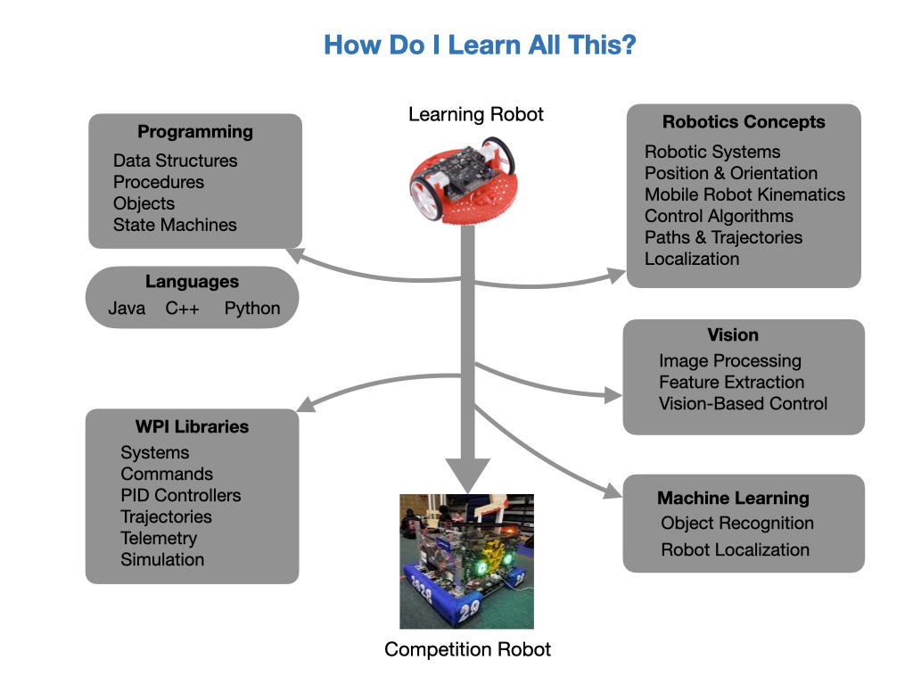

# FRC Programming Outline
*Programming experience of students; none, Webpage development, C++ Arduino, Java.*

*FIRST For Inspiration and Recognition of Science and Technology*

This course is about programming a robot to compete in the FIRST Robotics Competition.  The mechanical and electrical teams will design and build the physical robot and it's our job as a member of the programming team to get it to do something.  Without us, the robot will be sitting in the middle of the game field doing nothing.

The FIRST Robotics Competition (FRC) is setup as a large sporting event. So there are cheering crowds, match commentators, and large event screens that display the game scores and team rankings. The event is also filmed and streamed live out onto the Internet.  Teams compete in the specially constructed arena about the size of a basketball court and the goal is to score as many points as possible while at the same time preventing the other team from scoring.  The key difference is that instead of human players on the game field you have robots.  Each team gets to bring one custom built robot to the competition together with a driver and pit crew. It's similar to Formula One racing where you have a driver, and pit crew that maintains and fixes the robot between matches. It's not a gentle sport, robots are crashing into one another all the time both intentionally and unintentionally.  The robot is designed specifically to navigate the obstacles on the field manipulate the game pieces. The obstacles, game pieces and rules of the game change every year, so teams need to design and build a new robot each season.

The FIRST organization is world wide and its purpose is to inspire young people to enter the field of science and technology.  Instead of competing with a ball you're competing with math, science, and technology.  There are a lot of kids that aspire to be a professional sports players but only a very few can make it.  But to quote Dean Kaman, the founder of FIRST Robotics, *"FIRST Robotics is like a sport where everyone can turn pro"*.  

## Robots from a Programming Perspective
A robot is a machine that senses and interacts with its environment.  Most robots will accept commands that tell it what tasks are to be completed. From a programming perspective you can think of a robot as a data driven machine.  Data is constantly being fed into it from onboard sensors, and command input devices such as game controllers.  The internal brain of the robot, which is usually some kind of *Single Board Computer (SBC)*, will interpret the data and make a decision on what to do.  Often, that decision is to make a movement that interacts with its surroundings.  That can mean moving forward several meters or perhaps picking up an object that is in front of it.

## What do I Need to Learn?

So what do you need to learn in order to effectively program the robot for competition?  In order to write code for a project you need to have a good understanding of what you are programming.  To program a robot you need to have an understanding of multiple engineering disciplines.  These include; Control Systems, Kinematics & Dynamics, Computer Vision, Machine Learning, and of course Programming.  Engineers can spend an entire career in just one of these subjects but don't worry, you don't need to know each subject in depth.  Over the next few seasons you'll get to understand a little about each subject.  Enough to win competitions.

## References