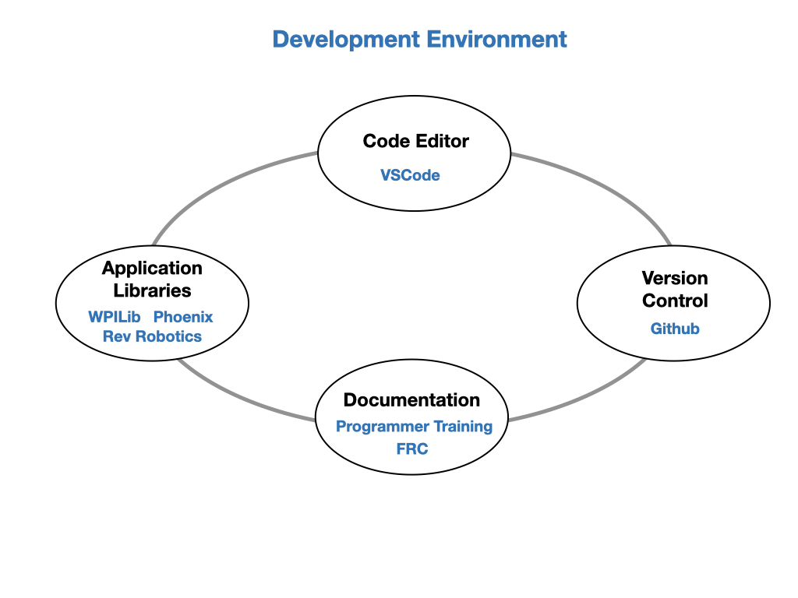

# Progamming Environment Setup

There are four major components needed for our program development:  

- **Code Editor** 
    In order to write your program you're going to need a code editor.  A code editor is similar to a word processor except that it is optimized to format program code rather than written text. It'll check the syntax of your code as you type it to make sure that it will compile properly. Each project is made up of multiple files that are also managed by the editor.  Once you're ready to try the program  out the compilation can be done in the editor before deploying it to the target computer.  The code editor used in FRC is *VSCode*.

- **Programming Libraries**
    When writing a new program you don't start from scratch.  There are normally a set of libaries available that have a lot of the code writen for you.  These libraries a very specific to the application that you're trying to create, the main ones used for FRC are the *WPILib*, *Phoenix*, and *REV Robotics* libraries.

- **Version Control System**
    Most programming projects will require you to work in teams.  This means that you're going to have multiple people adding and deleting files, and at times changing the same file.  To organize all of this you need a *Version Control System VCS*. A VCS has a single source, called a repository, that acts as the ground truth for all files in the project. Team members will create their own copy of this source repository on their development machine and work on that copy.  After making changes to the files they can be checked in and merged back into the source repository.  All changes are tracked so as they can be backed out if neccessary.

- **Documentation**
    Documentation is a very important part of a development environment.  It explains the syntax of the programming language that you're coding in and how to use the application libraries.  Documentation is usually very detailed and extensive, defining every aspect of the language or library.  You will need to refer to it constantly when you are working on a project, especially when you're learning.

## Testing Environment

- Romi Robot
- RoboRIO Robot
- Robot Simulator
- Phoenix Tuner

## Learning Objectives

- Install the WPILib version of VSCode.
- Screen functions and navigation.
- Overview of Github
- Setup a Github account
- Create your first Github repository.
- Clone it back into VSCode.
- Upload the Romi example program to your Github repository.

## References

[VSCode Install](../SoftwareInstall/vscodeSoftware.md)
[Github](../Tools/git.md)