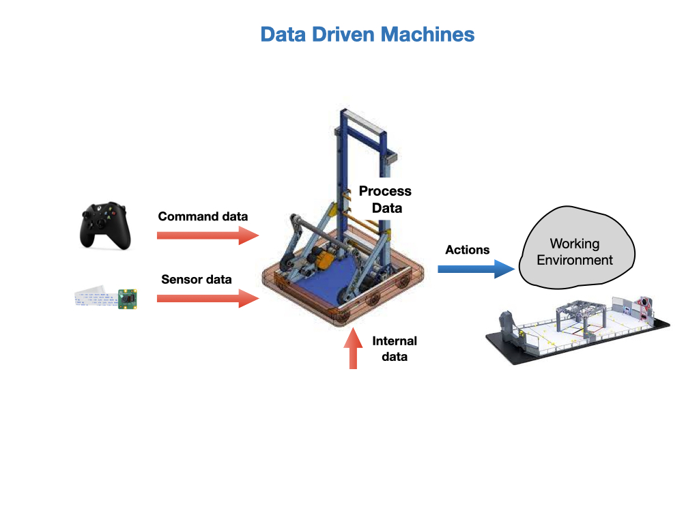

# Robot Systems
At this point we've setup our development environment, played around with the Romi robot, and seen the competition robot in action. What we're going to do now is go through a step-by-step process to learn how to program these robots.  

So what's going to happen in the New Year is that the programming team is going to get the robot and we will have about a week to test out all of our code before the first competition.  Fortunatelly, we're going to have a pretty good idea of what it needs to do and can get most of the code written ahead of time.  So what is it that the code needs to do?

Generally, we need to get the robot to do three things:

- **Step 1**. Figure out where it is within its working environment.  In our case, that is the game field.
- **Step 2**. Understand and interpret what's around it.  Targets, game pieces, ect.
- **Step 3**. Physically interact with those objects.

All of those tasks will require processing data. From a programming perspective you can think of a robot as a data driven machine.  Data is constantly being fed into it from onboard sensors that are detecting the world around it and telling it about its current state. Our control algorithms will interpret the data and make a plan what to do next.

In order to do this we need to represent the robot in computer code.  We'll start with the code needed to create the basic robot structure, then talk about subsystems and commands, and that will give us the components to go onto the most interesting stuff, which is the control algorithms.  The control algorithms is where all of the creative stuff happens.

The mechanical and electrical teams deal with the atoms and the programming team deals with the bytes.

